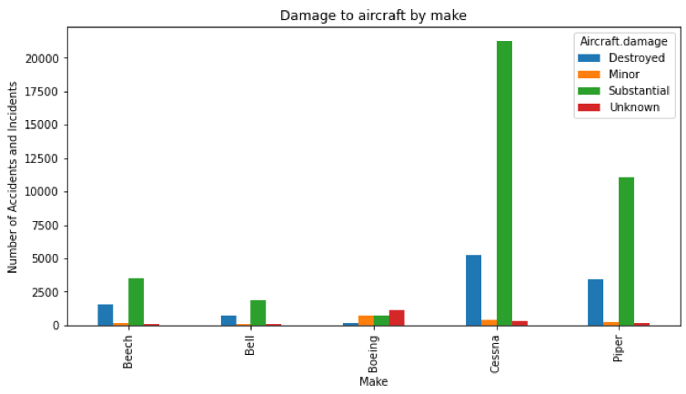

# Aviation Risk Assessment

## Project Overview and business understanding
In this project I use and analyse aviation incident data to identify the least risky aircraft for a company expanding into the aviation industry to purchase, ideally for commercial and private flight. The motivation for this project stems from a business goal to diversify the company’s portfolio into the aviation industry as part of the 'Vision 2030' campaign.

The overarching objective of the project is to provide actionable insights to help the head of the new aviation division make an informed decision on the safest and most reliable aircraft to buy.

## Dataset overview
The dataset used in this analysis comes from the National Transportation Safety Board and contains data about civil aviation accidents and selected incidents in the United States and international waters from 1962 to 2023.

### Key Data Attributes:
- **Make and Model of Aircraft**: Identifies the aircraft involved.
- **Aircraft Damage**: Indicates the extent of damage to the aircraft.
- **Purpose of Flight**: Describes the intended use of the aircraft during the incident.
- **Phase of Flight**: Specifies the broad flight phase when the incident occurred.
- **Date of Incident**: Provides the date on which the incident took place.
- **Total Records**: 88,889 incident records spanning 31 columns.

## Limitations
- The dataset only contains records of incidents, with no data on non-incident flights for comparison.
- Lack of data descriptions required educated assumptions about certain columns.
- High proportion of missing values in some columns may impact the robustness of conclusions.
- Inconsistent spelling and variations in categorical data had to be manually corrected.

## Data Cleaning
The data cleaning process involved the following steps:
1. **Handling Missing Values**: Imputed missing values where appropriate.
2. **Standardizing Categorical Data**: Corrected spelling errors and standardised formats.
3. **Creating New Column**: Created a 'Flight Category' column based on the 'Purpose.of.flight' for more targeted analysis.
4. **Removing Erroneous Values**: Filtered out inconsistent or redundant entries.

## Key Findings
### 1. Incident Frequency by Make
Since the dataset only contains incident data, a higher frequency of incidents for a specific make does not necessarily indicate higher risk. Instead, it is likely reflective of higher frequency/popularity of usage. Among private and commercial flights, Cessna was the most common make, appearing in 53.3% and 44.8% of incidents respectively.

### 2. Aircraft Damage by Make
When analyzing the severity of incidents, it was found that Cessna aircraft have the lowest rate of damage being deemed 'destroyed' (19%) compared to other makes, indicating a higher chance of the aircraft being salvageable after an incident. Conversely, Boeing aircraft data was skewed by a high proportion of 'Unknown' damage records which lead to it being the only make the significantly deviated from the expected trend.

### 3. Phase of Flight Analysis
Landing and takeoff were identified as the most incident-prone phases, consistent across most makes except Bell aircraft, which showed a high proportion of incidents during maneuvering. This pattern may suggest a systemic issue with Bell aircraft when performing maneuvering operations.

## Recommendation
- **Purchase Recommendation**: Cessna aircraft, as they are the most commonly used in private and commercial settings and demonstrate a lower rate of destruction.
- **Caution with Bell Aircraft**: Due to the high rate of incidents during maneuvering, it is advisable to investigate further before purchasing Bell models.

## Next Steps
1. Conduct further analysis with more comprehensive data, including non-incident flight records.
2. Perform market research to analyse the financial aspects of acquiring and operating various aircraft types, then perform a cost-benefit analysis.

## Author
George Nyang'aya

For more information, connect with me on [LinkedIn](www.linkedin.com/in/george-nyang-aya-18009a229).

